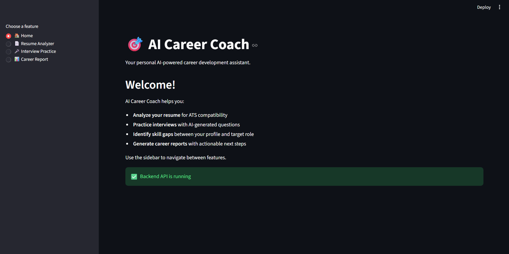

# 🎯 AI Career Coach

> An AI-powered career development platform that helps students and job seekers improve their resumes, prepare for interviews, identify skill gaps, and track their progress over time.





## ✨ Features

- **📄 Resume Analyzer** — Upload PDF/DOCX, get ATS score, strengths/weaknesses
- **🔍 Skill Gap Analysis** — Compare skills against 5 target roles
- **🎤 AI Interview Simulator** — Technical, HR, Behavioral interviews with evaluation
- **📊 Career Report** — Combined readiness score + personalized learning roadmap

## 🛠️ Tech Stack

| Layer | Technology |
|-------|-----------|
| Language | Python 3.11 |
| Backend | FastAPI |
| Frontend | Streamlit |
| Database | Supabase (planned) |
| Resume Parsing | pdfplumber, python-docx |
| AI | OpenAI API (planned) |

## 📁 Project Structure

## 🚀 Quick Start

```bash
# Clone the repo
git clone https://github.com/Neigh-god/ai-career-coach.git
cd ai-career-coach

# Create virtual environment
python -m venv venv

# Activate (Windows)
venv\Scripts\activate

# Activate (Mac/Linux)
source venv/bin/activate

# Install dependencies
pip install -r requirements.txt

# Start backend (Terminal 1)
uvicorn app.main:app --reload --host 127.0.0.1 --port 8000

# Start frontend (Terminal 2)
streamlit run frontend/app.py
 # 🎯 AI Career Coach
...
[all the content]
...
Built with ❤️ using FastAPI + Streamlit
